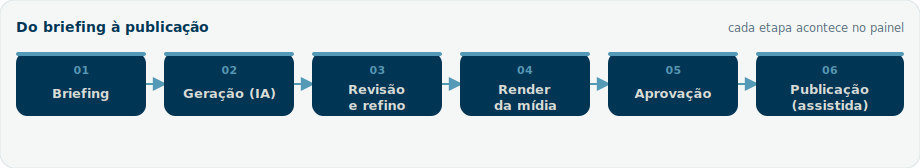
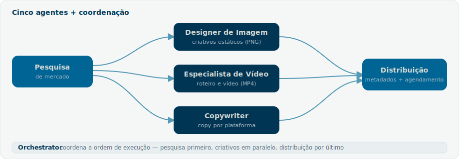
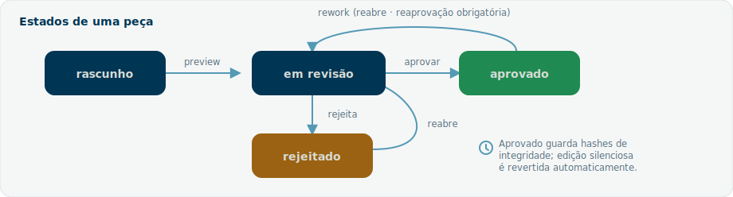
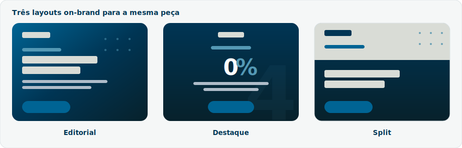

# Guia de Uso — Equipe de Marketing 4Selet

*Manual operacional do sistema de marketing com IA da 4Selet. Documento vivo: descreve como o sistema funciona e como operá-lo em qualquer campanha ativa.*

> [!IMPORTANT] Existem dois caminhos para usar o sistema
> O **Painel web** é o caminho principal — uma interface visual onde você cria, revisa e aprova conteúdo com cliques, sem digitar prompts. A **extensão Claude Code no VSCode** é o caminho secundário, para automações avançadas, pipeline e scripts. Comece pelo painel (Seções 4 e 5).

---

## Sumário

1. [Sobre este guia](#1-sobre-este-guia)
2. [Visão geral do sistema](#2-visão-geral-do-sistema)
3. [Conceitos fundamentais](#3-conceitos-fundamentais)
4. [Instalação e configuração](#4-instalação-e-configuração)
5. [Início rápido no painel](#5-início-rápido-no-painel)
6. [Operação no painel](#6-operação-no-painel)
7. [Tipos de conteúdo](#7-tipos-de-conteúdo)
8. [Os agentes](#8-os-agentes)
9. [Identidade de marca e governança](#9-identidade-de-marca-e-governança)
10. [Workflow de aprovação](#10-workflow-de-aprovação)
11. [Caminho avançado](#11-caminho-avançado)
12. [Renderização de mídia](#12-renderização-de-mídia)
13. [Integrações externas](#13-integrações-externas)
14. [Resolução de problemas](#14-resolução-de-problemas)
15. [Referência rápida](#15-referência-rápida)
16. [Manutenção deste guia](#16-manutenção-deste-guia)

---

## 1. Sobre este guia

Este guia explica, em ordem de uso, como operar o sistema de geração de conteúdo de marketing da 4Selet. Ele é **independente de campanha**: descreve o funcionamento permanente do sistema. Quando uma campanha específica aparece, é apenas como **exemplo** — substitua pelos dados da campanha que estiver ativa no momento.

**Para quem é este guia**

| Perfil | O que ler primeiro |
| --- | --- |
| Quem vai operar no dia a dia | Seções 4, 5 e 6 (painel) |
| Quem aprova conteúdo | Seções 6 e 10 (revisão e workflow) |
| Quem cuida da marca | Seções 8 e 9 (agentes e governança) |
| Perfil técnico / automação | Seções 11 a 13 (avançado, render, integrações) |

**Convenções**

Os blocos destacados ao longo do texto indicam o peso da informação:

> [!NOTE]
> Contexto útil ou detalhe que vale conhecer.

> [!TIP]
> Atalho ou boa prática que economiza tempo.

> [!WARNING]
> Ponto de atenção que pode gerar retrabalho se ignorado.

> [!CAUTION]
> Ação sensível ou irreversível — leia antes de executar.

Trechos em `fonte monoespaçada` são comandos, nomes de arquivos ou caminhos.

---

## 2. Visão geral do sistema

O sistema transforma um briefing simples em peças de marketing prontas para publicar — imagens, vídeos curtos, carrosséis e textos por plataforma — sempre dentro da identidade da marca 4Selet, com uma trilha de revisão e aprovação rastreável.

**Os dois caminhos**

| Caminho | O que é | Quando usar |
| --- | --- | --- |
| **Painel web** | Interface visual em `http://localhost:4500` | Dia a dia: criar, revisar, aprovar |
| **Extensão Claude Code (VSCode)** | Chat com os agentes, pipeline e scripts | Automação, lotes, controle fino |

Os dois caminhos compartilham a mesma base: os mesmos agentes, as mesmas regras de marca e o mesmo workflow de aprovação por baixo. O que muda é a forma de operar.

**Fluxo de alto nível**

```
Briefing  ->  Geração (IA)  ->  Revisão e refino  ->  Render da mídia  ->  Aprovação  ->  Publicação
                                                                                            (assistida)
```



**Arquitetura resumida**

```
Pesquisa de mercado
        |
        +--> Designer de Imagem    --+
        +--> Especialista de Vídeo   +--> Distribuição
        +--> Copywriter            --+
              (coordenados pelo Orchestrator)
```



São **cinco agentes** especializados, um **Orchestrator** que coordena a ordem de execução, e uma camada de **governança de aprovação** por cima de tudo. No total, o sistema empacota **sete skills** (os cinco agentes, o orchestrator e o task-promoter). Detalhes na Seção 8.

---

## 3. Conceitos fundamentais

Leia esta seção uma vez; ela destrava o resto do guia.

| Termo | O que significa |
| --- | --- |
| **Agente** | Um papel especializado (pesquisador, designer, copywriter etc.). Não é um software autônomo: é o Claude incorporando aquele papel quando a tarefa exige. |
| **Skill** | A ficha de instruções de um agente, em `skills/<nome>/SKILL.md`. Define o que ele faz, quando atua e quais regras segue. |
| **Knowledge file** | Documento de marca em `knowledge/`. Fonte de verdade sobre identidade, produto e plataformas. Lido antes de qualquer geração. |
| **Campanha** | Um agrupador lógico de peças no painel, com um ângulo/tema. Uma peça pode existir sem campanha. |
| **Task (peça)** | Uma unidade de conteúdo: uma pasta em `outputs/` com o conteúdo, a mídia e o `status.json`. |
| **status.json** | A fonte de verdade de cada task: estado, histórico, aprovador, hashes de integridade. |
| **Workflow de aprovação** | A máquina de estados que leva uma peça de rascunho até aprovada (Seção 10). |
| **Geração real vs. simulada** | Com a chave da IA configurada, a geração é real. Sem a chave, o sistema roda em modo simulado (rotulado), útil para testar o fluxo. |

---

## 4. Instalação e configuração

### 4.1 Painel web (recomendado)

Pré-requisito: Node.js instalado.

```bash
cd interface
npm install        # apenas na primeira vez
npm start          # sobe o painel em http://localhost:4500
```

Abra `http://localhost:4500` no navegador.

> [!TIP]
> Em servidor (VPS), rode o painel como serviço gerenciado pelo PM2, que reinicia sozinho após queda ou reboot:
> ```bash
> pm2 restart painel-4selet --update-env
> pm2 logs painel-4selet        # acompanhar logs
> ```

### 4.2 Configurar a chave da IA

Sem chave, a geração funciona em **modo simulado** (conteúdo rotulado, sem custo). Para gerar com IA real:

1. No painel, abra **Configurações**.
2. Cole a chave da Anthropic (`sk-ant-...`) e salve.
3. Use **Testar chave** para confirmar a conexão.

A chave fica gravada em `interface/.env` (arquivo local, fora do controle de versão). O modelo padrão é `claude-sonnet-4-6` e pode ser trocado em Configurações.

> [!CAUTION]
> A chave dá acesso de cobrança à API. Nunca a compartilhe nem a inclua em commits. Se suspeitar de exposição, revogue-a no console da Anthropic e gere uma nova.

### 4.3 Extensão Claude Code (avançado)

Para o caminho secundário, abra o projeto no VSCode com a extensão Claude Code. Você conversa direto com os agentes e roda os scripts e o pipeline descritos na Seção 11.

---

## 5. Início rápido no painel

Sua primeira peça em poucos minutos:

1. **Configurações** — confirme que a chave está conectada (Seção 4.2). Sem ela, a peça sai simulada.
2. **Campanhas** — crie uma campanha (ou pule e gere uma peça avulsa).
3. **Criar Conteúdo** — escolha o tipo (ex.: *Feed Instagram*), escreva um briefing curto e claro do tema, e opcionalmente preencha **Referência visual / mood**.
4. **Gerar com IA** — revise o resultado no editor; ajuste o texto ou use **Aplicar ajuste** para refinar com IA.
5. **Salvar na campanha** — a peça é criada e você é levado à tela de aprovação.
6. **Preview e aprovação** — gere o preview, revise e aprove.

> [!TIP]
> Um bom briefing é específico: público, objetivo da peça, ângulo e um número ou prova, se houver. Quanto mais claro o briefing, menos refino depois.

---

## 6. Operação no painel

Esta é a seção central — o fluxo completo do dia a dia.

### 6.1 Painel inicial (Dashboard)

Mostra os totais (campanhas, peças, em revisão, aprovadas). **Cada card é clicável** e leva à lista já filtrada — por exemplo, o card *Em revisão* abre a biblioteca filtrada por esse estado.

### 6.2 Campanhas

Crie uma campanha para agrupar peças sob um mesmo tema/ângulo. As peças geradas podem ser ligadas a ela, o que mantém o trabalho organizado e permite reaproveitar o ângulo entre peças.

### 6.3 Criar conteúdo

1. Escolha o **tipo de conteúdo** (Seção 7).
2. Escreva o **briefing** (mínimo de alguns caracteres; quanto mais específico, melhor).
3. Opcional: **Referência visual / mood** — descreve o clima e o estilo a evocar (sempre dentro da marca). Direciona o conceito visual da peça.
4. **Gerar com IA**. O resultado aparece em um editor.

> [!NOTE]
> O conteúdo textual (Feed, LinkedIn, Threads) é editável diretamente como texto. Carrossel e Vídeo têm um **editor estruturado**: cada slide ou cena é um cartão com campos próprios, e você pode adicionar, remover e reordenar os itens.

### 6.4 Revisar e refinar

- **Carrossel / Vídeo:** edite slide a slide (título e texto) ou cena a cena (tipo, texto on-screen, subtexto e direção de arte). Os botões `↑` `↓` `✕` reordenam e removem; "+ Adicionar" cria um novo item. Para editar o JSON à mão, abra **JSON (avançado)**, altere e clique em **Aplicar JSON aos campos**.
- **Texto (Feed / LinkedIn / Threads):** edite diretamente no campo de texto.
- Em qualquer tipo, use **Aplicar ajuste**: descreva a mudança em linguagem natural (ex.: "encurte o headline e troque o CTA") e a IA reescreve mantendo o resto.

**Prévia da arte (peças visuais).** Para Imagem, Feed e Carrossel, o botão **Ver prévia da arte** renderiza o PNG real da peça ali mesmo na tela de criação — usando o conteúdo atual e o template selecionado —, sem precisar salvar. Assim você vê como a arte fica antes de comprometer a peça à campanha. Ajuste o texto ou troque o template e clique em **Atualizar prévia da arte** para gerar de novo.

> [!TIP]
> A prévia usa o mesmo motor de renderização da mídia final (Seção 12), então o que você vê é fiel ao PNG que será gravado ao salvar.

### 6.5 Salvar e gerar a mídia

Ao **Salvar na campanha**, a peça vira uma task. Para os tipos visuais, a mídia final é renderizada (Seção 12): imagem, feed e carrossel viram PNG; vídeo vira MP4.

### 6.6 Aprovar ou descartar

- **Preview** gera uma página de revisão e move a peça para *em revisão*.
- **Aprovar** promove a peça (registra quem aprovou e quando, e calcula hashes de integridade).
- **Descartar** arquiva a peça de forma reversível (vai para `outputs/_archived/`, nunca é apagada de imediato).

### 6.7 Biblioteca de conteúdo

Onde todas as peças vivem. Recursos:

| Recurso | Para que serve |
| --- | --- |
| Selo **Novo** | Marca peças ainda não abertas; some na primeira visualização. |
| **Tags** | Rótulos livres por peça (separados por vírgula). Mais flexíveis que pastas: uma peça pode ter vários contextos. |
| **Filtros** | Por estado, tipo e tags; a busca também considera as tags. |
| **Lightbox** | Visualização ampliada (imagens e preview) centralizada, com download. |
| **Download** | Baixa o arquivo final da peça. |

### 6.8 Configurações

Chave da IA, modelo e **Aparência** (tema e cor de destaque do painel).

---

## 7. Tipos de conteúdo

O painel gera seis tipos, cada um com formato e mídia final próprios:

| Tipo | Plataforma | Saída | Mídia final |
| --- | --- | --- | --- |
| Feed Instagram | Instagram | Texto (legenda + hashtags) | Texto |
| Carrossel Instagram | Instagram | Estruturado (slides) | PNG por slide |
| Imagem / Anúncio | Instagram | Estruturado (layout) | PNG 1080x1080 |
| Vídeo (short-form) | Instagram | Estruturado (cenas) | MP4 |
| Post LinkedIn | LinkedIn | Texto editorial | Texto |
| Post Threads / X | Threads / X | Texto curto | Texto |

Cada tipo segue as regras de formatação da sua plataforma (tamanho, hashtags, tom), definidas nos knowledge files (Seção 9).

---

## 8. Os agentes

Cinco agentes especializados, coordenados pelo Orchestrator. No painel, eles atuam por baixo; na extensão, você pode acioná-los diretamente.

### 8.1 Pesquisa de mercado

Conduz pesquisa estruturada de inteligência de mercado (tendências, concorrência, audiência, ganchos). Produz dados estruturados e um brief que alimenta os demais agentes.

> [!NOTE]
> A pesquisa real depende de uma integração externa (Seção 13). Sem ela, roda em modo simulado.

### 8.2 Designer de Imagem (Ad Creative Designer)

Gera criativos estáticos como especificação de layout e os renderiza em PNG (1080x1080) via Playwright. Escolhe o tipo de layout conforme plataforma e objetivo, e produz a copy do anúncio (headline, subtexto, CTA).

### 8.3 Especialista de Vídeo

Cria conceitos de vídeo curto e o roteiro cena a cena (gancho, demonstração, benefício, CTA) em estrutura pronta para renderização em vídeo (Seção 12).

### 8.4 Copywriter

Transforma o tema em copy nativa de cada plataforma (Instagram, Threads/X, LinkedIn, YouTube), ajustando tom, tamanho, CTA e formato de hashtags.

### 8.5 Distribuição

Monta os metadados de publicação por plataforma, recomenda agendamento e protege a publicação real atrás de um gate (a publicação só ocorre sob condições explícitas — Seção 10).

### 8.6 Orchestrator

Não é um agente: é a skill de coordenação. Recebe um payload com a tarefa e as plataformas, valida, e executa os agentes na ordem de dependência (pesquisa primeiro, depois os criativos em paralelo, distribuição por último).

---

## 9. Identidade de marca e governança

Toda peça gerada deve respeitar a marca 4Selet. As regras vivem em `knowledge/` e são lidas antes de qualquer geração.

| Knowledge file | Define |
| --- | --- |
| `brand_identity.md` | Posicionamento, paleta oficial, tipografia, voz e tom, regras de CTA e hashtags, checklist de governança. |
| `product_campaign.md` | Produto, diferenciais, provas e a campanha vigente (ângulos e headlines aprovadas). |
| `platform_guidelines.md` | Especificações e tom por plataforma; sequenciamento de distribuição. |

**Identidade visual (fixa)**

- Paleta oficial: Selet Darker `#07212B`, Navy `#003554`, Blue `#006494`, Sky `#5499B5`, Mist `#AFBCC9`, Cloud `#D9DCD6`.
- Tipografia: Inter para tudo; JetBrains Mono apenas para trechos técnicos.
- Logo claro sobre fundos escuros, logo escuro sobre fundos claros, sem efeitos.

**Governança automática**

O sistema roda uma verificação de marca sobre o conteúdo antes de salvar. Violações duras bloqueiam o salvamento até serem corrigidas.

> [!WARNING]
> A campanha citada nos knowledge files muda com o tempo. Não fixe peças em uma campanha encerrada: gere sempre referenciando a campanha **ativa no momento**. Exemplos neste guia (como a campanha "Taxa Zero") servem apenas de ilustração.

---

## 10. Workflow de aprovação

Camada de governança que dá às peças uma trilha de revisão rastreável, integridade pós-aprovação e um gate duplo de publicação.

### 10.1 Estados

```
rascunho -> em revisão -> aprovado -> em revisão (rework)
                  +------ rejeitado -> em revisão
```



Cada task carrega um `status.json` versionado, com estado, histórico (somente acréscimo), aprovador, data e hashes de integridade dos arquivos aprovados.

### 10.2 Onde cada peça fica

| Estado | Pasta | Versionado em git |
| --- | --- | --- |
| Rascunho / em revisão | `outputs/<task>_<data>/` | Não |
| Aprovado | `outputs/approved/<task>_<data>/` | Sim |
| Rejeitado | `outputs/archive/<task>_<data>/` | Sim |

### 10.3 Regra de reaprovação

Peças aprovadas não podem ser editadas no lugar. Para alterar, rode o rework (volta a peça para *em revisão*); a reaprovação passa a ser obrigatória. Uma verificação automática de integridade detecta edições silenciosas e reverte o estado, preservando o registro da aprovação anterior.

> [!CAUTION]
> Nunca edite arquivos dentro de `outputs/approved/` diretamente. Use o rework — caso contrário a peça perde a garantia de integridade e a verificação automática a reverte.

### 10.4 Gate de publicação

Antes de qualquer publicação real, o sistema exige um conjunto de condições (estado aprovado, hashes íntegros em tempo de execução, tokens presentes e confirmação explícita). Se qualquer condição falhar, aquela peça não é publicada — sem bloquear as demais.

---

## 11. Caminho avançado

Para quem opera pela extensão Claude Code e por linha de comando.

### 11.1 Scripts do workflow

```bash
# criar a task
node scripts/orchestrator.js --task <nome> --date AAAA-MM-DD --platforms instagram,linkedin

# gerar preview e mover para revisão
node scripts/generate_preview.js --task <nome> --date AAAA-MM-DD

# aprovar
node scripts/promote_task.js --task <nome> --date AAAA-MM-DD --to approved --by "<aprovador>"

# verificar o gate antes de publicar
node scripts/check_approval_gate.js --task <nome> --date AAAA-MM-DD

# auditorias periódicas
node scripts/check_approved_integrity.js --auto-revert
node scripts/validate_status.js
```

### 11.2 Pipeline executável

O pipeline roda os agentes de ponta a ponta. Por padrão é **sequencial**; com uma fila configurada (Seção 13), passa a rodar de forma **assíncrona**.

```bash
npm run pipeline:run                       # payload padrão
npm run pipeline:run:payload <arquivo.json>  # payload específico
npm run pipeline:worker                    # worker da fila (terminal separado)
```

---

## 12. Renderização de mídia

| Tipo de peça | Motor | Saída |
| --- | --- | --- |
| Imagem, Feed, Carrossel | Playwright (HTML para PNG) | PNG (ex.: 1080x1080; um PNG por slide no carrossel) |
| Vídeo | Remotion (React) | `video/video.mp4` |

No painel, a renderização acontece ao salvar/aprovar a peça visual. O vídeo é renderizado pela composition `BrandStory` do projeto Remotion em `src/`.

### Templates visuais (peças estáticas)

Imagem, feed e carrossel podem ser renderizados em três layouts on-brand, selecionáveis no painel antes de **Renderizar** / **Re-renderizar**. A escolha fica salva por peça, então re-renderizações e o reabrir da peça mantêm o template.

| Template | Visual | Quando usar |
| --- | --- | --- |
| Editorial | Gradiente azul, Selet Dots, logo no topo, headline à esquerda | Padrão; mensagem com subtexto descritivo |
| Destaque | Fundo escuro centralizado, símbolo "4" como marca-d'água | Headlines curtas com número em evidência (ex.: `0%`, `95%`) |
| Split | Faixa clara (logo + rótulo) sobre faixa escura (headline + CTA) | Contraste editorial, números realçados na headline |



Todos seguem a paleta e a tipografia oficiais (logo claro sobre fundo escuro, escuro sobre claro). Números e percentuais na headline recebem realce automático na cor Sky.

> [!NOTE]
> A primeira renderização de vídeo após subir o servidor é mais lenta (o motor monta o bundle a frio). As seguintes são rápidas. Pela linha de comando, `npm run render` renderiza a composition padrão do projeto.

---

## 13. Integrações externas

Estas integrações são **opcionais**. Sem elas, os módulos correspondentes rodam em modo simulado e o painel continua funcionando normalmente.

| Integração | Habilita | Status sem a chave |
| --- | --- | --- |
| Chave da Anthropic | Geração de conteúdo com IA real | Pendente — geração simulada |
| Pesquisa (Tavily) | Pesquisa de mercado real | Pendente — pesquisa simulada |
| Armazenamento (Supabase) | Hosting de mídia e URLs públicas | Pendente — hosting simulado |
| Fila (Redis) | Pipeline assíncrono (fila) | Pendente — roda sequencial |
| Publicação (Instagram / YouTube) | Publicação automática | Pendente — publicação assistida |

> [!TIP]
> Comece só com a chave da Anthropic. As demais integrações podem ser ativadas depois, conforme a necessidade.

---

## 14. Resolução de problemas

| Sintoma | Causa provável | O que fazer |
| --- | --- | --- |
| Conteúdo sai rotulado como "simulado" | Chave da IA não configurada | Configure a chave em Configurações (Seção 4.2). |
| Aviso de limite de requisições (429) | Muitas chamadas em pouco tempo | Aguarde alguns segundos e tente de novo; o painel mostra um aviso e libera o botão. |
| "Chave inválida" ao gerar | Chave incorreta ou revogada | Revise a chave em Configurações; gere uma nova se necessário. |
| Ajuste bloqueado por regra de marca | A IA produziu algo fora das regras | Reescreva a orientação do ajuste e tente de novo. |
| Render de vídeo demorou e falhou | Primeira renderização a frio | Tente novamente; a partir da segunda fica rápido. |
| Peça aprovada some da edição | Comportamento esperado | Use o rework para reabrir (Seção 10.3). |
| Painel não responde | Serviço caiu | `pm2 restart painel-4selet --update-env` e verifique `pm2 logs`. |

---

## 15. Referência rápida

### 15.1 Estrutura do projeto

| Pasta | Conteúdo |
| --- | --- |
| `interface/` | Painel web (caminho principal) |
| `skills/` | As sete skills (cinco agentes + orchestrator + task-promoter) |
| `pipeline/` | Orchestrator, worker e agentes executáveis |
| `scripts/` | Workflow de aprovação e utilitários |
| `src/` | Projeto Remotion (vídeo) |
| `knowledge/` | Fonte de verdade da marca |
| `assets/` | Logos, kit de identidade e vídeos de referência |
| `outputs/` | Peças geradas; `approved/` e `archive/` versionados |
| `docs/` | Material de aula e histórico |

### 15.2 Comandos essenciais

```bash
cd interface && npm start            # subir o painel
pm2 restart painel-4selet            # reiniciar como serviço
npm run pipeline:run                 # rodar o pipeline
node scripts/validate_status.js      # auditar estados das tasks
```

### 15.3 Documentos relacionados

| Documento | Para quê |
| --- | --- |
| `STATUS_PROJETO.md` | Estado atual do projeto |
| `CLAUDE.md` | Contexto técnico e arquitetura |
| `SPEC_WORKFLOW_APROVACAO.md` | Contrato técnico do workflow |
| `README.md` | Visão geral e início rápido |
| `interface/README.md` | Detalhes do painel |

---

## 16. Manutenção deste guia

Este guia tem duas formas: a fonte em `GUIA_DE_USO.md` e a versão estilizada em `GUIA_DE_USO.html`, gerada a partir da fonte.

Para regenerar o HTML após editar o `.md`:

```bash
node scripts/build_guide_html.js
```

O gerador converte o Markdown em HTML com a paleta 4Selet, ícones no lugar de emojis e os blocos de destaque (`[!NOTE]`, `[!TIP]`, `[!WARNING]`, `[!CAUTION]`). Abra o `GUIA_DE_USO.html` com duplo-clique no navegador.

> [!NOTE]
> Mantenha a fonte `.md` como original e regenere o HTML — não edite o HTML à mão, pois ele é sobrescrito a cada geração.
