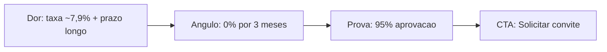

# Marketing Research Agent

**Camada estrategica** do pipeline: transforma um nicho/topico em **inteligencia de marketing estruturada** (machine-readable) que todos os agentes criativos downstream consomem. Pesquisa via **Tavily**, sintetiza em campos estruturados, e emite 3 deliverables.

## When to Use This Skill

- Usuario pede "pesquisa de mercado", "research", "insights de campanha", "tendencias", "inteligencia de marketing".
- O Orchestrator enfileira o job `research_agent` (primeiro estagio, antes dos agentes criativos).

**NAO use para:** gerar ad estatico (`ad-creative-designer`), video (`video-ad-specialist`), copy/captions (`copywriter-agent`) ou publicacao (`distribution-agent`). Esta skill so produz a **inteligencia** que alimenta esses.

## CRITICAL: Regra de Re-aprovacao (Workflow de Aprovacao)

Antes de QUALQUER escrita em `outputs/`, esta skill DEVE verificar o caminho.

**Deteccao:** se o caminho comeca com `outputs/approved/`, a task ja foi aprovada por
um humano. Qualquer edicao invalida a aprovacao.

**Acao obrigatoria:** PARAR. NAO escrever, NAO sobrescrever, NAO criar. Avisar:

> A task `<task_name>` (`<task_date>`) esta APROVADA. Para editar, rode:
>
> `node scripts/promote_task.js --task <task_name> --date <task_date> --to in_review`
>
> Isso move a task de volta para `outputs/<task_name>_<task_date>/`. Depois disso, a
> skill pode editar normalmente, e a task precisara ser re-aprovada pelo fluxo padrao.

**Apos confirmacao e execucao:** reler `status.json`, confirmar `status = "in_review"`
e caminho `outputs/<task>_<date>/`, e SO ENTAO retomar.

**Reportar ao final:**

> Aviso: task `<task_name>` saiu de `approved` e voltou para `in_review`. Precisa ser
> re-aprovada antes de publicar.

Inegociavel. Sem excecao para "edicao minima" ou "fix rapido".

## CRITICAL: chave Tavily e modo simulado

- **Busca real** requer `TAVILY_API_KEY` no ambiente **e** o SDK instalado (`npm i @tavily/core`).
- **Sem a chave** (estado atual do projeto): a skill opera em **modo SIMULADO (dry-run)** — o agente sintetiza a inteligencia a partir dos knowledge files, **rotulando o output como simulado** (`_simulated: true`, `_label`). Nao invente dados de mercado como se fossem reais; deixe claro que sao simulados.
- O script empacotado `scripts/research.js` detecta a chave: com chave, roda as 5 buscas e grava `research_raw.json`; sem chave, avisa e sai (o agente segue em simulacao).

> **Dois caminhos de execucao (importante):** este SKILL descreve o **fluxo agente-skill** (Claude roda a skill e produz os 3 deliverables, sendo `research_results.json` o contrato machine-readable). O **pipeline executavel** (`pipeline/agents.js`) e o **painel** (`interface/lib/research.js`) seguem um caminho mais enxuto: gravam um advisory `research/insights.md` e o painel roda **3 buscas** (nao 5) para enriquecer o prompt de geracao. Ambos respeitam os mesmos knowledge files e guardrails; o schema completo de `research_results.json` e o alvo do fluxo agente-skill.

## CRITICAL: antes de pesquisar/sintetizar

Carregue os knowledge files (fonte de verdade da marca 4Selet):

1. `knowledge/brand_identity.md` -> Target Audience, What 4Selet Is Not, concorrentes proibidos, Brand Governance.
2. `knowledge/product_campaign.md` -> Campanha Taxa Zero, selling points, 9 diferenciais, prova-ancora 95%, glossario.
3. `knowledge/platform_guidelines.md` -> plataformas-alvo e tom.

A inteligencia gerada deve **ancorar** nesses arquivos — nao produzir insights genericos desalinhados da marca.

## Inputs

| Input | Exemplo | Obrigatorio |
|-------|---------|-------------|
| Nicho / topico | "plataforma de pagamentos para produtor digital estabelecido" | Inferir se ausente |
| task_name | `taxa_zero_maio` | Inferir |
| task_date | `2026-05-26` | Inferir (hoje) |

**Defaults:** nicho = posicionamento da 4Selet (plataforma de pagamentos para produtor estabelecido, campanha Taxa Zero); audiencia = Produtor Estabelecido (R$ 50k+/mes). Declare os defaults assumidos.

---

## Step 1: Rodar as 5 buscas Tavily (ou simular)

Cinco buscas direcionadas (CLAUDE.md):

| # | Foco | Query template |
|---|------|----------------|
| 1 | **Tendencias** | tendencias {nicho} {ano} |
| 2 | **Concorrentes / mercado** | taxas e prazos de plataformas de pagamento para infoproduto (mercado) |
| 3 | **Audiencia** | dores do produtor digital estabelecido sobre taxas, prazos, aprovacao |
| 4 | **Ad hooks** | angulos e hooks de anuncio que convertem em {nicho} |
| 5 | **Topicos virais** | topicos em alta / discussoes {nicho} redes sociais |

```bash
node skills/marketing-research-agent/scripts/research.js --task <task_name> --date <task_date> --topic "<nicho>" --out outputs/<task_name>_<date>
```

- Com `TAVILY_API_KEY`: grava `outputs/<task>/research_raw.json` (resultados brutos das 5 buscas).
- Sem chave: imprime aviso e sai 0 — siga para Step 2 em **modo simulado**.

## Step 2: Sintetizar em inteligencia estruturada

A sintese e o trabalho ESTRATEGICO do agente (nao deterministico). A partir dos resultados brutos (ou, em simulacao, dos knowledge files), produza os campos do schema:

- **content_topics** — temas de conteudo (educativo, conversao, mercado).
- **marketing_angles** — angulos de campanha (ex.: "migracao sem trauma", "0% por 3 meses para medir a diferenca", "95% de aprovacao = mais receita liquida").
- **keywords** — termos de SEO/segmentacao (plataforma de pagamentos, multi-adquirencia, area de membros, taxa zero...).
- **ad_hooks** — ganchos curtos para ad/video (ex.: "Quanto a taxa come da sua venda?").
- **video_concepts** — conceitos de video (referencie os 4 Conceitos do `product_campaign.md` quando couber).
- **selected_campaign_angle** — UM angulo escolhido para coerencia entre todos os assets.

> **Regra de marca na sintese:** os campos que alimentam criativos (`ad_hooks`, `marketing_angles`, `content_topics`) **nunca** citam concorrentes nominalmente — mercado so em abstrato (~7,9%). Se a busca trouxer nomes (Hotmart, Kiwify, etc.), mantenha-os apenas num campo `competitive_landscape` marcado **"internal only — nao usar em criativo"**. Numeros da Taxa Zero sempre corretos (0% por 3 meses OU R$ 300 mil; R$ 1,99; D+10; D+30; 95%).

## Step 3: Escrever research_results.json (o CONTRATO)

Este e o **deliverable machine-readable** que os agentes downstream consomem. Schema canonico:

```json
{
  "task_name": "taxa_zero_maio",
  "task_date": "2026-05-26",
  "brand": "4Selet",
  "campaign": "Taxa Zero",
  "audience": {
    "primary": "Produtor estabelecido (R$ 50k+/mes) insatisfeito com taxas, prazos ou suporte",
    "pain_points": ["taxa de mercado ~7,9%", "prazo de recebimento longo", "aprovacao de cartao baixa", "medo de migrar e perder vendas"]
  },
  "content_topics": ["...", "..."],
  "marketing_angles": ["...", "..."],
  "keywords": ["plataforma de pagamentos", "multi-adquirencia", "taxa zero", "..."],
  "ad_hooks": ["Quanto a taxa come da sua venda?", "..."],
  "video_concepts": ["Os 4 Numeros", "Migracao Sem Trauma", "..."],
  "selected_campaign_angle": "Migracao sem perder margem: 0% por 3 meses ou ate R$ 300 mil em vendas",
  "campaign_facts": {
    "taxa_plataforma": "0% por 3 meses ou ate R$ 300 mil em vendas (o que ocorrer primeiro)",
    "custo_por_transacao": "R$ 1,99", "prazo_pix": "D+10", "prazo_cartao": "D+30",
    "prova_ancora": "95% de aprovacao no cartao", "acesso": "por convite"
  },
  "competitive_landscape": "internal only - nao usar em criativo",
  "_simulated": true,
  "_label": "TESTE/SIMULADO quando sem TAVILY_API_KEY"
}
```

> Campos obrigatorios consumidos downstream: `ad_hooks` + `selected_campaign_angle` (ad-creative-designer, video-ad-specialist), `marketing_angles` + `keywords` (video, copy), `campaign_facts` (todos). **Mantenha esses nomes de campo** — sao o contrato. Em modo simulado, inclua `_simulated: true`.

## Step 4: research_brief.md (Markdown + Mermaid)

Report human-readable. Inclua: resumo executivo, audiencia/dores, angulo selecionado, e **um diagrama Mermaid** do funil ou do mapa de angulos. Ex.:

```

```

## Step 5: interactive_report.html (Chart.js)

Dashboard interativo estilizado com a marca (paleta oficial 4Selet, Inter). Chart.js via CDN. Ex.: bar chart de prioridade dos angulos, ou comparativo de prazos/taxas (mercado abstrato vs Taxa Zero). Fundo Selet Darker/Navy, accents Selet Blue. Sem branco/preto puro.

## Step 6: Output storage

```
outputs/<task_name>_<date>/
├── research_raw.json          ← Step 1 (so com TAVILY_API_KEY)
├── research_results.json      ← Step 3 (CONTRATO machine-readable)
├── research_brief.md          ← Step 4 (Mermaid)
└── interactive_report.html    ← Step 5 (Chart.js)
```

> **Persistencia:** `outputs/` pode nao persistir entre sessoes neste ambiente. Se for um exemplo canonico para reuso, salve uma copia em `skills/marketing-research-agent/examples/`.

---

## Brand Guardrails (4Selet)

- **Concorrentes:** analise de mercado e permitida internamente, mas **nunca** surface nomes (Greenn, Hubla, Kiwify, Hotmart, Eduzz, Ticto, Cakto, Monetizze, Perfect Pay) nos campos que alimentam criativos. Mercado em abstrato ("~7,9%").
- **Numeros Taxa Zero corretos:** 0% por 3 meses OU R$ 300 mil; R$ 1,99/transacao; PIX D+10; cartao D+30; 95% aprovacao. Nunca "0% pra sempre" / "100% gratis".
- **Audiencia:** produtor estabelecido (R$ 50k+/mes) — nao iniciante. Ver `brand_identity.md` (quem NAO e o publico).
- **Tom dos insights:** sobrio, ancorado em dado/prazo/processo; sem promessa magica.
- **Modo simulado:** sempre rotular (`_simulated: true`) — nao apresentar dados inventados como pesquisa real.

## Examples

### Example 1: Pipeline Taxa Zero (com chave)
**Orchestrator:** job `research_agent`, topico "plataforma de pagamentos / produtor estabelecido". -> roda 5 buscas Tavily -> `research_raw.json` -> sintetiza -> 3 deliverables. `selected_campaign_angle` propaga para ad/video/copy.

### Example 2: Sem chave (dry-run)
**Usuario:** "Gera a pesquisa do test_job_payload_1." -> sem `TAVILY_API_KEY` -> simula a partir dos knowledge files, `research_results.json` com `_simulated: true`, rotulado TESTE.

### Example 3: Inputs faltando
**Usuario:** "Faz a research da 4Selet." -> defaults (nicho = posicionamento 4Selet / Taxa Zero), **declara** os defaults, gera os deliverables.

## Troubleshooting

### "TAVILY_API_KEY ausente"
**Cause:** sem chave/SDK. **Solution:** modo simulado (rotulado) OU `npm i @tavily/core` + setar `TAVILY_API_KEY` para busca real.

### Cannot find module '@tavily/core'
**Cause:** SDK nao instalado. **Solution:** `npm i @tavily/core` (o script so faz require quando a chave existe).

### Insights genericos / fora da marca
**Solution:** re-ancorar nos knowledge files; aplicar os guardrails; garantir `campaign_facts` corretos.

## Quality Checklist

- [ ] Knowledge files carregados (brand_identity, product_campaign, platform_guidelines)
- [ ] 5 buscas rodadas (com chave) OU modo simulado claramente rotulado (`_simulated: true`)
- [ ] `research_results.json` com o schema/contrato (ad_hooks, marketing_angles, keywords, video_concepts, selected_campaign_angle, campaign_facts)
- [ ] Nenhum concorrente nominal nos campos de criativo; mercado em abstrato; numeros Taxa Zero corretos
- [ ] 3 deliverables gerados (JSON + brief.md Mermaid + interactive_report.html Chart.js)
- [ ] Tudo em `outputs/<task_name>_<date>/` (+ copia em examples/ se for fixture)

## Relacionamento com outras skills (contrato downstream)

```
marketing-research-agent (esta skill)
  research_results.json
    ├─ ad_hooks, selected_campaign_angle ─► ad-creative-designer (layout.json/headline)
    ├─ ad_hooks, marketing_angles, keywords, video_concepts ─► video-ad-specialist (scenes.json)
    ├─ selected_campaign_angle, keywords ─► copywriter-agent (caption/title/tags)
    └─ campaign_facts ─► todos (0% · R$1,99 · D+10 · D+30 · 95%)
```

E a **camada estrategica**: define o `selected_campaign_angle` que mantem ad + video + copy coerentes. Roda **primeiro** no pipeline; os demais consomem seu `research_results.json`.

## Performance Notes

- Qualidade > velocidade. Sempre ancore nos knowledge files; nao gere insight generico.
- Lidere angulos/hooks com numero-ancora (Taxa Zero ou 95%).
- Em simulacao, seja honesto: rotule e nao invente metricas de mercado como reais.
