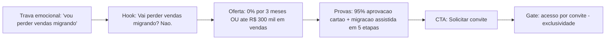

# Research Brief — taxa_zero_demo — 2026-05-29

> **DEMO/SIMULADO** (sem `TAVILY_API_KEY`) · Marca: 4Selet · Campanha: Taxa Zero · Âncora de vídeo: **Migração Sem Trauma**

## Resumo executivo

O **produtor estabelecido** (R$ 50k+/mês) já está em outra plataforma e tem dor em quatro variáveis (taxa ~7,9% no mercado, prazo longo, aprovação de cartão baixa, suporte impessoal). Mas a maior **trava emocional** para mudar de fornecedor é o medo de **derrubar a operação** no mês da migração. O ângulo que destrava: *"Migração sem perder margem — 0% por 3 meses ou até R$ 300 mil em vendas."* Migração assistida + um trimestre sem taxa de plataforma = janela real para o produtor **medir a diferença** sem risco financeiro.

## Audiência e dores (priorizadas)

1. **Medo de perder vendas migrando** (objeção #1)
2. Taxa de mercado ~7,9% comendo a margem
3. Prazo de recebimento longo (15–30 dias)
4. Aprovação de cartão abaixo do ideal (receita perdida silenciosa)
5. Suporte impessoal

## Ângulo selecionado

> **Migração sem perder margem: 0% por 3 meses ou até R$ 300 mil em vendas.**

## Mapa do funil

## Hooks priorizados (do hook 1 ao 4)

1. **Vai perder vendas migrando? Não.** *(ataque direto à objeção; usado no vídeo)*
2. Quanto a taxa come da sua venda?
3. Você não precisa derrubar a operação para migrar.
4. 3 meses para medir a diferença.

## Estrutura proposta (vídeo Reels, 15s)

| Beat | Tempo | Texto-âncora |
|------|-------|--------------|
| Hook | 0–3s | *Vai perder vendas migrando?* |
| Resposta | 3–6s | *Não. O time conduz.* |
| Mecânica | 6–10s | *0% por 3 meses. R$ 1,99 por transação.* |
| Prova | 10–13s | *95% de aprovação no cartão.* |
| CTA | 13–15s | *Solicitar convite.* |

## Fatos da campanha (gabarito)

0% pela plataforma por **3 meses OU até R$ 300 mil em vendas** (o que vier primeiro) · **R$ 1,99**/transação · PIX em **D+10** · cartão em **D+30** · **95% de aprovação** no cartão · acesso **por convite** · migração **assistida em 5 etapas** (aceite, migração dos produtos, integrações, treinamento, publicação).

*Concorrentes: análise só interna; em criativo, mercado em abstrato (~7,9%).*
