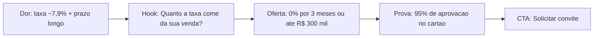

# Research Brief — teste_research — 2026-05-29

> **TESTE/SIMULADO** (sem `TAVILY_API_KEY`) · Marca: 4Selet · Campanha: Taxa Zero

## Resumo executivo

Público-alvo: **produtor estabelecido** (R$ 50k+/mês) insatisfeito com taxas (~7,9% de mercado), prazos longos e suporte impessoal. O ângulo vencedor é **migração sem perder margem**: a Taxa Zero (0% por 3 meses ou até R$ 300 mil) dá ao produtor um trimestre para medir a diferença, com a 4Selet conduzindo a migração.

## Audiência e dores

- Taxa de mercado ~7,9% corroendo a margem
- Prazo de recebimento longo (15–30 dias)
- Aprovação de cartão abaixo do ideal = receita perdida silenciosa
- Medo de perder vendas ao migrar

## Ângulo selecionado

**Migração sem perder margem: 0% por 3 meses ou até R$ 300 mil em vendas.**

## Mapa do funil (Mermaid)

## Hooks priorizados

1. Quanto a taxa come da sua venda?
2. 7,9% de taxa. E o dinheiro demorando a cair.
3. Vai perder vendas migrando? Não.
4. 0% por 3 meses. Para quem sabe que é Selet.

## Fatos da campanha (gabarito)

0% por 3 meses **ou até R$ 300 mil** · R$ 1,99/transação · PIX D+10 · cartão D+30 · 95% aprovação · acesso por convite.

*Concorrentes: análise só interna; em criativo, mercado em abstrato (~7,9%).*
